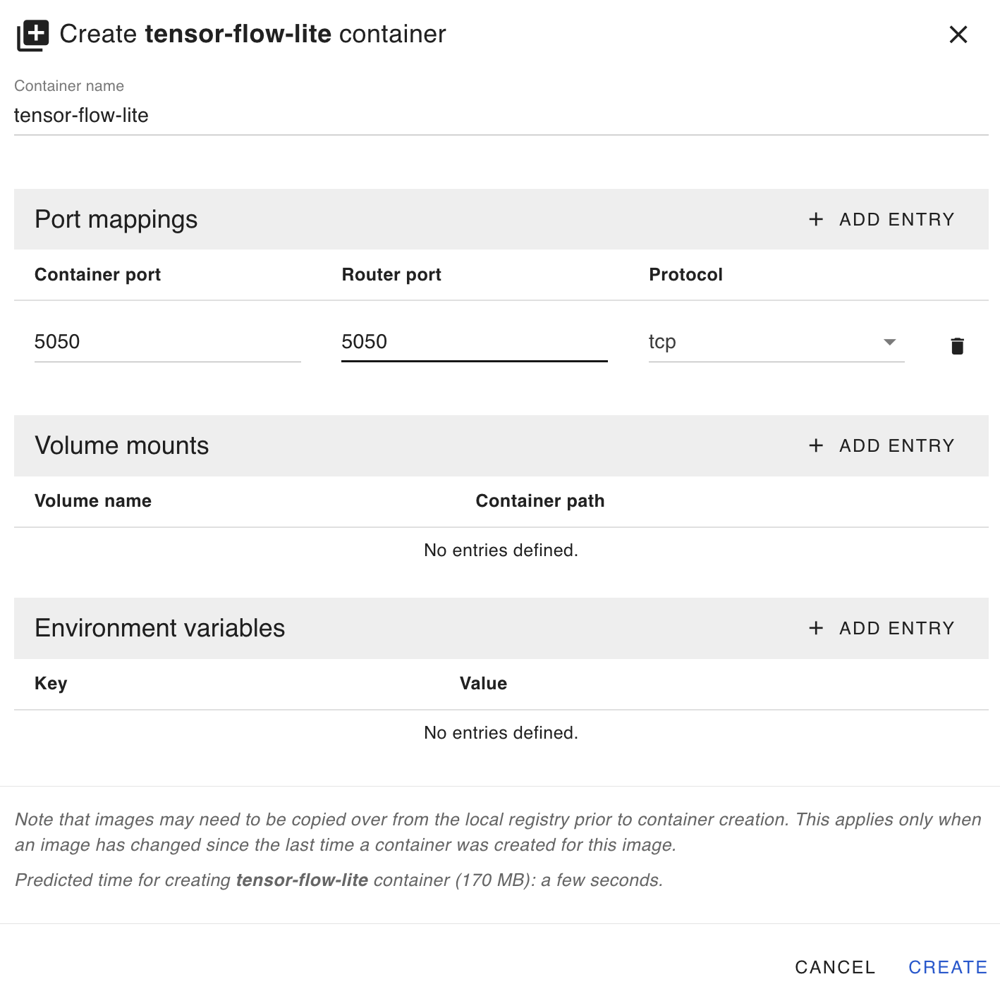

# Edge App - Fault Detection System with Node-RED and TensorFlow Lite

This project demonstrates an edge computing setup that simulates sensor data, performs fault detection using a TensorFlow Lite model, and visualizes the results using Node-RED. Designed for deployment on the IXON SecureEdge Pro, this solution showcases how to integrate machine learning and visualization tools at the edge for real-time diagnostics.

Key components of this project include:

1. A training environment to generate synthetic data and train a TensorFlow model for fault detection.
2. A lightweight TensorFlow Lite inference server for efficient fault prediction at the edge.
3. A Node-RED-based dashboard to simulate sensor data and display predictions in real-time.

This project provides a robust foundation for implementing advanced edge analytics and proactive maintenance strategies in industrial IoT environments. Users can adapt and extend the solution for their specific needs.

## Prerequisites

Ensure your environment is properly set up by following this guide: [Running custom Docker applications on the SecureEdge Pro](https://support.ixon.cloud/hc/en-us/articles/14231117531420-Running-custom-Docker-applications-on-the-SecureEdge-Pro).

## Steps to Deploy the Fault Detection System

### 1. Train the Model

#### On Unix-based systems:

Run the `train_model.sh` script from the project root directory:

```bash
./train_model.sh
```

#### On Windows:

Run the `train_model.cmd` script from the project root directory:

```cmd
train_model.cmd
```

These scripts will:

- Build the training container.
- Generate synthetic data.
- Train a TensorFlow model and convert it to TensorFlow Lite format.
- Copy the generated `.tflite` model to the `tensor-flow-lite` directory for deployment.

### 2. Build and Push Containers

Run the `build_and_push_containers.sh` script to build and push all project containers:

For Unix-based systems:

```bash
./build_and_push_containers.sh
```

For Windows:

```cmd
build_and_push_containers.cmd
```

### 3. Deploy the Containers on SecureEdge Pro

#### TensorFlow Lite Inference Container

- Access the local web interface of the SecureEdge Pro.
- Create a `tensor-flow-lite` container using the `tensor-flow-lite` image with the following settings:
  - **Port Mapping:** `5050:5050`

Refer to the screenshot for configuration details:



#### Node-RED Container

- Create a `node-red` container using the `node-red` image with the following settings:
  - **Port Mapping:** `1880:1880`
  - **Volume Mapping:** `node-red-data -> /data`

Refer to the screenshot for configuration details:


### 4. Start the Containers

- Wait for the containers to be created and start them via the SecureEdge Pro interface.

### 5. Access Node-RED Dashboard

- In IXON Cloud, create an HTTP Web Server to access the Node-RED dashboard on the SecureEdge Pro.

Refer to the screenshot for configuration details:


- Open the Node-RED dashboard to configure the flows and simulate sensor data.

### 6. Access Node-RED Virtual HMI

- In IXON Cloud, create an HTTP Web Server to access the Node-RED Virtual HMI on the SecureEdge Pro.

Refer to the screenshot for configuration details:


- Open the Node-RED Virtual HMI to monitor the system.

### 7. Access TensorFlow Lite Inference API

- The TensorFlow Lite Flask API will be available at `http://<gateway-ip>:5050/predict`. Node-RED sends simulated sensor data to this endpoint for inference.

### 8. Troubleshooting

- Ensure containers are running and accessible.
- Check the Node-RED debug nodes and logs for errors.
- Verify that the TensorFlow Lite model is loaded and accessible in the inference container.

## Customization

- **Model Threshold/Probability**: Adjust the fault probability in `generate_dataset.py` to better simulate real-world scenarios.
- **Model Architecture**: Modify the model in `train.py` for improved accuracy or performance.
- **Node-RED Flows**: Customize the `flows.json` file to integrate additional logic or sensor inputs.

## Conclusion

This project provides a complete edge computing solution for real-time fault detection, serving as a starting point for implementing advanced IoT diagnostics and analytics. With easy deployment on IXON's SecureEdge Pro, it enables users to leverage edge-level AI and visualization tools for enhanced operational efficiency.
